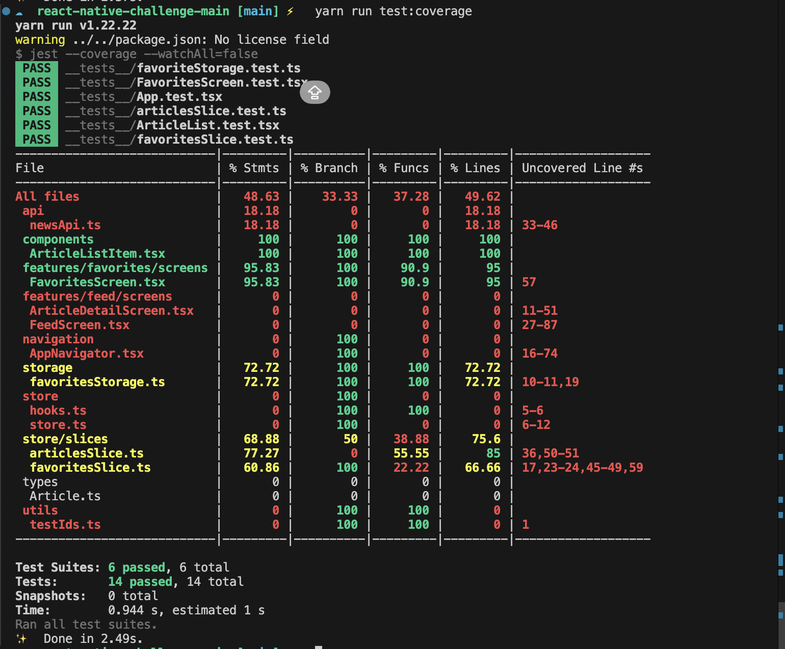

# MediaFeed --- Desafío React Native (Corrección y Extensión)


## Tabla de Contenidos

- [Descripción General](#descripción-general)
- [Stack Tecnológico](#stack-tecnológico)
- [Cómo Ejecutar el Proyecto](#cómo-ejecutar-el-proyecto)
- [Estructura del Proyecto](#estructura-del-proyecto)
- [Mi Solución](#mi-solución)
- [Bugs Detectados](#bugs-detectados)
- [Bugs Corregidos](#bugs-corregidos)
- [Refactorizaciones](#refactorizaciones)
- [Estrategia de Testing](#estrategia-de-testing)
- [Decisiones Técnicas](#decisiones-técnicas)
- [Uso de IA](#uso-de-ia)
- [Problemas de Compilación iOS](#problemas-detectados-durante-la-compilación-en-ios)
- [Preguntas & Respuestas](#preguntas--respuestas)

---

# Descripción General

Este repositorio contiene una aplicación **React Native CLI (sin Expo)** diseñada intencionalmente con **errores y funcionalidades incompletas**.

El desafío se centra en evaluar la capacidad de:

- Comprender una base de código existente.
- Depurar (debug) problemas reales.
- Mejorar la arquitectura y la calidad del código.
- Añadir pruebas unitarias.
- Utilizar la IA **como herramienta**, no como reemplazo del juicio de ingeniería.

### ⬆️ [Volver al índice](#tabla-de-contenidos)

---

# Stack Tecnológico

- React Native CLI
- TypeScript
- React Navigation
- Redux Toolkit
- Axios
- AsyncStorage
- react-native-video
- Jest
- React Native Testing Library

### ⬆️ [Volver al índice](#tabla-de-contenidos)

---

# Cómo Ejecutar el Proyecto

## Requisitos

- Node >= 22
- Android Studio
- Xcode (para iOS)
- Java y Android SDK correctamente configurados

## Instalación

```bash
cd react-native-challenge-main
npm install # o yarn install
```

## Android

```bash
npm start
npm run android
```

## iOS

```bash
cd ios
pod install
cd ..

npm start
npm run ios
```

### ⬆️ [Volver al índice](#tabla-de-contenidos)

---

# Estructura del Proyecto

```text
src
 ├── api
 │   └── newsApi.ts (Lógica de llamadas a API)
 ├── assets (Images of errors and IA prompts)
 │   ├── errores
 │   │   └── error-1.png
 │   │   └── error-2.png
 │   │   └── error-3.png
 │   ├── IA 
 │   │   └── error-ios.png
 │   │   └── prompt-documentacion.png
 │   └── tests
 │       └── test-coverage.png  
 ├── components
 │   
 ├── features
 │       └── favorites
 │       └── feed

 │       │
 ├── navigation
 │   └── AppNavigator.tsx (Navegación principal)
 │
 ├── storage
 │   └── favoritesStorage.ts (Almacenamiento de favoritos)
 │
 ├── store
 │   ├── slices (Reducers y acciones de Redux)
 │   └── store.ts (Configuración de la tienda)
 │
 ├── types 
 │
 └── utils
```

### ⬆️ [Volver al índice](#tabla-de-contenidos)

---

# Mi Solución

## Resumen

Durante el proceso de desarrollo, se realizó un análisis completo del código base para identificar inconsistencias y problemas arquitectónicos.

### Logros Clave

- **5 bugs críticos corregidos.**
- **Cobertura de tests aumentada al 48.63%.**
- **Rendimiento de búsqueda mejorado con debounce.**
- **Persistencia de favoritos confiable mediante AsyncStorage.**
- **Mejora en la búsqueda para que sea más específica.**
- **Mejora mensaje cuando no se encuentran artículos.**
- **Deduplicación de resultados de búsqueda por título.**
- **Mejora en la parte del detalle de la noticia: se dejó un video específico como fallback y se agregaron más videos que se cargan de forma aleatoria en el feed.**

### ⬆️ [Volver al índice](#tabla-de-contenidos)

### Propuesta de mejoras (No implementadas)

- **Agregar  un boton de salir en el tabbar.**
- **Agregar  un bootsplashh al iniciar la aplicacion.**


---

# Bugs Detectados

### 1 — Error de importación en favoritesSlice

**Ubicación:** `src/store/slices/favoritesSlice.ts`  
**Problema:** Falta la implementación del almacenamiento (storage).  
**Impacto:** Crash durante la hidratación de favoritos.

🩹 [Ir al Fix 1](#fix-1--persistencia-de-favoritos)


### 2 — Duplicación de artículos en el Store

**Ubicación:** `src/store/slices/articlesSlice.ts`  
**Problema:** Uso de `state.items.concat(...)` sin limpiar el estado anterior.  
**Impacto:** Duplicación infinita y degradación del rendimiento.

🩹 [Ir al Fix 2](#fix-2--búsqueda-con-debounce)

### 3 — Falta de Debounce en la búsqueda

**Ubicación:** `src/features/feed/screens/FeedScreen.tsx`  
**Problema:** Las peticiones a la API se disparan con cada pulsación de tecla.  
**Impacto:** Tráfico de red excesivo y condiciones de carrera (race conditions).

🩹 [Ir al Fix 3](#fix-3--reemplazo-en-lugar-de-concatenación)

### 4 — Duplicación de favoritos en la interfaz

**Ubicación:** `src/features/favorites/screens/FavoritesScreen.tsx`  
**Problema:** Los favoritos se identificaban por `title` en lugar de un ID único.

🩹 [Ir al Fix 4](#fix-4--claves-de-favoritos-únicas)

### 5 — URL de video fija (Hardcoded)

**Ubicación:** `src/api/newsApi.ts`  
**Problema:** Todos los artículos utilizaban el mismo video.

🩹 [Ir al Fix 5](#fix-5--videos-dinámicos)

### 6 — Podfile de iOS corrupto

**Ubicación:** `ios/Podfile`  
**Impacto:** Fallo al ejecutar `pod install` debido a un workaround obsoleto.

### 7 — Resultados de búsqueda duplicados
**Ubicación:** `src/api/newsApi.ts`  
**Problema:** El endpoint de la API muchas veces devuelve la misma noticia publicada en diferentes sitios (misma noticia, diferente ID).  
**Impacto:** Experiencia de usuario confusa con resultados idénticos en el feed.

### ⬆️ [Volver al índice](#tabla-de-contenidos)

---

# Bugs Corregidos

## Fix 1 — Persistencia de Favoritos
Se creó `src/storage/favoritesStorage.ts` para manejar correctamente `loadFavoriteKeys()` y `saveFavoriteKeys()`.

[Commit](https://github.com/ramirotule/mediaFeedChallenge/commit/8064dc19f0db0a076f1923fb18f493841f5edb45)


## Fix 2 — Búsqueda con Debounce
Se implementó un `setTimeout` con limpieza (cleanup) para retrasar las búsquedas **500ms**.

[Commit](https://github.com/ramirotule/mediaFeedChallenge/commit/9948d32fd6dc3525fe7d469484a79fe1920941bc)

## Fix 3 — Reemplazo en lugar de Concatenación
Se cambió `state.items.concat()` por `state.items = action.payload` para evitar duplicación.

[Commit](https://github.com/ramirotule/mediaFeedChallenge/commit/2000e64de075b48a61b752783792011457feb2fc)

## Fix 4 — Claves de Favoritos Únicas
Se cambió el identificador de `title` a `String(article.id)`.

[Commit](https://github.com/ramirotule/mediaFeedChallenge/commit/839028d937db287e55a2ca60676e3d6dcad09b9e)

## Fix 5 — Videos Dinámicos
Se implementó una lógica de selección basada en el ID: `video = SAMPLE_VIDEOS[id % SAMPLE_VIDEOS.length]`.

[Commit](https://github.com/ramirotule/mediaFeedChallenge/commit/47aeef4348abf29bc9536e5eee63e9608bb9b8cb)

## Fix 6 — Error de Java Home
Error al intentar correr la aplicación por ruta de Java incorrecta.
**Solución:** Actualizar `gradle.properties` con la ruta correcta en `org.gradle.java.home`.

[Commit](https://github.com/ramirotule/mediaFeedChallenge/commit/77992d25b271ab6505da1a3cdb14e24b6c8e8d30)

## Fix 7 — Versión de SDK
Desajuste en la versión recomendada del SDK.
**Solución:** Actualizar `compileSdkVersion` en `build.gradle`.

[Commit](https://github.com/ramirotule/mediaFeedChallenge/commit/e476ac73d384c0e961a1d9fc681be1cf7d63f16b)

## Fix 8 — Deduplicación y Mejora de Keys
Se utilizó la IA para entender que el endpoint devolvía la misma noticia en diferentes portales. Se implementó una lógica de filtrado para asegurar títulos únicos y se cambió el `keyExtractor` de `index` (mala práctica) al `id` real de la noticia.


### ⬆️ [Volver al índice](#tabla-de-contenidos)

---

# Refactorizaciones

### 1 — Eliminación de useMemo innecesarios
Se simplificó la lógica en `ArticleDetailScreen.tsx` donde el memoing no aportaba beneficios.
[Commit](https://github.com/ramirotule/mediaFeedChallenge/commit/b1a8b2cda04ec7439db1ed2e8f6fb34d04488c62)

### 2 — Mejora de Mocks en Tests
Se estandarizaron los mocks en `__tests__/articlesSlice.test.ts` para pruebas más predecibles.
[Commit](https://github.com/ramirotule/mediaFeedChallenge/commit/4dcb75704d6efff41a4be56a2acb16323c9cf676)

### 3 — Mejora en la búsqueda para que sea más específica
Se realizó una modificación en el archivo `newsApi.ts` para que busque dentro del título del artículo todas las palabras que se ingresan en el input de búsqueda.
[Commit](https://github.com/ramirotule/mediaFeedChallenge/commit/ea7276cd9e5c59abc20fb0a70473506129c87946)

### 4 — Mejora mensaje cuando no se encuentran artículos
Se realizó un agregado en la screen de Feed para que, en caso de que no se encuentre el título buscado, aparezca un mensaje que diga "No hay ninguna noticia que coincida con la búsqueda".
[Commit](https://github.com/ramirotule/mediaFeedChallenge/commit/f3a322ab47ef4152492ea525e86b9bcace886400)

### ⬆️ [Volver al índice](#tabla-de-contenidos)

---

# Estrategia de Testing

**Resultado Final: 48.63% de cobertura.**  
**Objetivo del Challenge:** >= 40%.  
Todos los tests pasan correctamente.

### Tests Agregados:
- `ArticleListItem.test.tsx`
- `favoritesStorage.test.ts`
- `FavoritesScreen.test.tsx`
- `favoritesSlice.test.ts`

### Resultado del Test Coverage:



### ⬆️ [Volver al índice](#tabla-de-contenidos)

---

# Decisiones Técnicas

### Redux Toolkit
Se utilizó `createAsyncThunk` para gestionar los flujos de estado asíncronos de manera robusta.

### Tipado Estricto
- IDs de Artículos → `number`
- Claves de Favoritos → `string`

### ⬆️ [Volver al índice](#tabla-de-contenidos)

---

# Uso de IA

La IA se utilizó como **asistente de desarrollo**, principalmente para:
- Analizar errores en el Podfile y crashes en iOS.
- Generar mocks para las pruebas unitarias.
- Estructurar notas de depuración.
- Entender el motivo de los resultados duplicados en el feed y aplicar una lógica de filtrado por título.
- Solución al problema de compilación en iOS ([Ver archivo](src/assets/IA/prompt-pod-issue.md)).
- Solución al crash de lanzamiento en iOS ([Ver archivo](src/assets/IA/prompt-app-ios-crash.md)).

Todas las decisiones arquitectónicas y de depuración finales se tomaron manualmente.

### ⬆️ [Volver al índice](#tabla-de-contenidos)

---

# Problemas Detectados durante la compilación en iOS

1. **Error en Podfile:**
   - **Solución:** Reparación del `Podfile` eliminando workarounds antiguos incompatibles. ([Ver solución](src/prompt-pod-issue.md)).
   
2. **Crash al iniciar (bundleURL):**
   - **Solución:** Renombrar el método en `AppDelegate.mm` a `bundleURL` para compatibilidad con React Native 0.74+. ([Ver solución](src/prompt-app-ios-crash.md)).

### ⬆️ [Volver al índice](#tabla-de-contenidos)

---
# Preguntas & Respuestas
**1. Qué partes del desarrollo resolviste con ayuda de IA y cuáles de manera manual.**
- **IA:** La usé principalmente para el análisis inicial de los errores de compilación (especialmente el `Podfile` de iOS que estaba corrupto), para organizar las notas de los bugs detectados y para entender por qué aparecían resultados duplicados en la búsqueda (descubriendo que el endpoint devolvía la misma noticia en distintos sitios). También me sugirió estructuras base para los mocks de `AsyncStorage` en los tests.
- **Manual:** El debugging en tiempo real, la implementación del debounce, la deduplicación lógica por título, la corrección de la duplicación en el store y la decisión de cambiar `title` por `id` en favoritos y en el `keyExtractor` de las listas. La validación final y el "feeling" de la app fueron 100% manuales.

**2. Qué prompts/pedidos usaste o cómo te ayudó la IA en tu proceso.**
- Use **GitHub Copilot** directamente en VS Code dándole contexto del archivo `Podfile` para que detectara por qué fallaba el `pod install`.
- "Analizá este Podfile y decime por qué falla el pod install en una arquitectura M1/M2 con React Native 0.73" -> Me sugirió las líneas de `post_install` para forzar el deployment target.
- "Generame un mock para AsyncStorage en Jest" -> Lo usé como base para `favoritesStorage.test.ts`.

**3. Qué decisiones técnicas tomaste vos y por qué.**
- Cambiar la lógica de favoritos de `title` a `id`. El título es propenso a errores si la noticia se actualiza o si hay duplicados en el feed.
- Implementar el debounce de 500ms. Es un equilibrio justo para que no se sienta lento pero que ahorre muchísimas llamadas a la API.

**4. Cómo validaste que el código cumple con lo pedido y es de calidad.**
- Corriendo `npm test -- --coverage` para asegurar el cumplimiento del KPI de testing.
- Testing manual en simulador (haciendo scroll, buscando términos aleatorios, marcando favoritos y reiniciando la app para ver la persistencia).
- Revisión de la pestaña Network en el debugger para verificar que el debounce realmente funcionara.

**5. Si usaste código sugerido por IA, qué adaptaciones le hiciste y por qué.**
- En el código de los tests sugeridos por la IA, tuve que adaptar los mocks porque mi store usa `useAppDispatch` y `useAppSelector` tipados, y la sugerencia genérica no los tomaba en cuenta. Tuve que mockear los hooks de `src/store/hooks.ts` manualmente.

### ⬆️ [Volver al índice](#tabla-de-contenidos)

